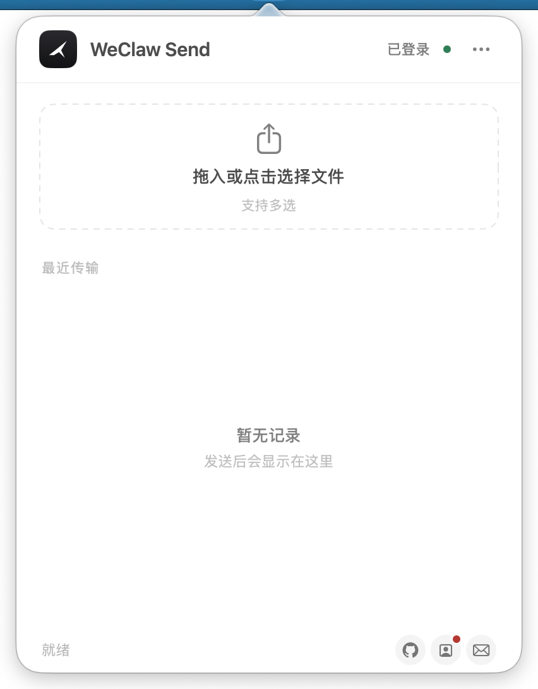
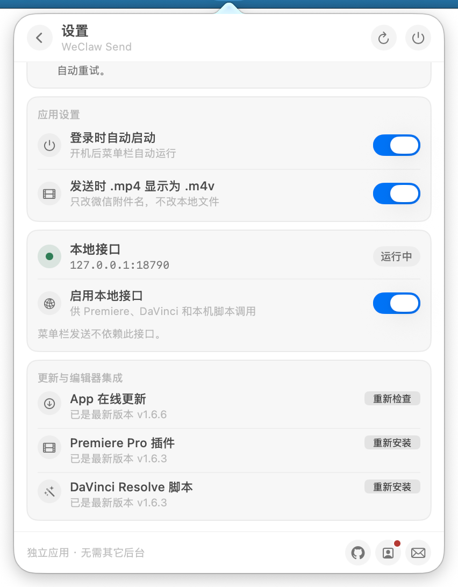
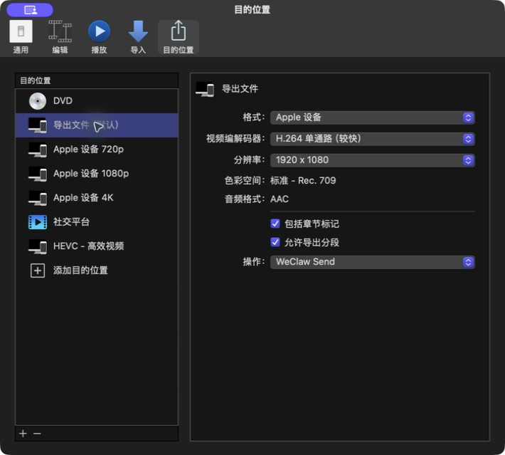

<p align="center">
  
</p>

<h1 align="center">WeClaw Send</h1>

<p align="center"><strong>把 Mac、Premiere、Final Cut Pro 和 DaVinci 的文件直接发到微信。</strong></p>

<p align="center">原生 macOS 菜单栏应用 · 可独立登录，也可复用 OpenClaw 的微信登录</p>

<p align="center">
  <a href="https://github.com/double2tea/WeClawSend/releases">下载最新版</a> ·
  <a href="https://weclaw-send.pages.dev/">作品页</a> ·
  <a href="docs/使用说明.md">使用说明</a> ·
  <a href="docs/INTEGRATION.md">本地接口</a>
</p>

## 界面

<p align="center">
  
  
</p>

## 安装

1. 从 [Releases](https://github.com/double2tea/WeClawSend/releases) 下载 DMG 或 ZIP，把 App 放进“应用程序”。
2. 点击菜单栏纸飞机，在设置中扫码登录微信；已经使用 OpenClaw，也可以把登录方式切到 OpenClaw。
3. 拖入文件，或点击面板选择文件。

项目没有 Apple Developer ID，发布包使用 ad-hoc 签名。第一次打开若被系统拦截，请在“系统设置 → 隐私与安全性”中选择“仍要打开”。

完整步骤与常见问题见 [使用说明](docs/使用说明.md)。App 和编辑器组件都可以在设置页检查更新。

## 发送

- 拖放或多选文件，最多同时处理 3 个任务
- 显示准备、加密、上传和发送进度；支持取消与失败重试
- 保留最近 20 条记录
- 可将微信里的 `.mp4` 附件名显示为 `.m4v`，不修改本地文件
- 可只读复用 OpenClaw 官方微信插件的登录；多个账号由你明确选择
- 支持登录时启动；空闲 30 秒后自动收起

单文件上限默认 200 MB，可在设置中选择 100 MB、200 MB、500 MB、1 GB 或 2 GB。更大的档位只调整 App 本地校验，最终能否送达仍取决于微信服务。文件可以并行准备，但微信消息会按顺序提交，相邻两条至少间隔 2 秒。

## 隐私

WeClaw Send 不设自有云端存储，不会向开发者上传文件或账号信息。文件仅通过微信官方 ClawBot API 发送至用户本人的微信 ClawBot；登录凭据、偏好设置和传输记录仅保存在本机。

选择 OpenClaw 登录时，WeClaw Send 只读取 `~/.openclaw/openclaw-weixin` 中当前账号和会话信息，不复制或修改这些文件，也不收取微信消息。OpenClaw 需要保持运行，以便微信回复后更新会话。

## Premiere、Final Cut Pro 与 DaVinci

### Premiere Pro

插件支持 Premiere Pro 25、26；后续版本只要继续支持 CEP，也可以直接使用。

- 自动使用当前序列名，可选择完整序列或 I/O 范围
- 使用 Adobe 导出预设，并记住预设、输出文件夹与自动发送开关
- 导出完成后即可继续操作其他序列，发送在后台进行
- 发送失败时保留成片，只重试发送，不重新渲染

在 App 设置中一键安装，重启 Premiere 后从“窗口 → 扩展 → WeClaw Send”打开。自动发送需要开启“本地接口”。

更多说明见 [Premiere 插件文档](premiere-cep/README.md)。

### Final Cut Pro

Final Cut Pro 可以在分享完成后直接把成片交给 WeClaw Send，不需要插件，也不需要开启本地接口。此功能需要 **WeClaw Send 1.6.8 或更高版本**。

<p align="center">
  
</p>

1. 把最新版 WeClaw Send 放进 `/Applications`，打开并确认微信已登录。
2. 打开“Final Cut Pro → 设置 → 目的位置（Destinations）”。
3. 选择“导出文件（Export File）”，在右侧“操作（Action）”中选择“其他（Other）”。
4. 选择 `/Applications/WeClaw Send.app`；返回后“操作”应显示 **WeClaw Send**，如上图。
5. 使用这个目的位置分享项目。Final Cut Pro 提示分享成功后，WeClaw Send 会弹出并开始发送。

建议使用 H.264 或 HEVC，并把单个成片控制在 200 MB 以内。如果不想让所有默认导出都自动发送，可以先复制一个“导出文件”目的位置并命名为“导出并发送微信”；如果希望 `Command-E` 直接发送，则把它设为默认。

如果 Final Cut Pro 显示分享成功，但 WeClaw Send 没有新增传输记录，请确认 App 版本不低于 1.6.8，并在“操作 → 其他”中重新选择 `/Applications/WeClaw Send.app`，避免仍指向旧版本或另一份 App。

### DaVinci Resolve

Deliver 后渲染脚本会在渲染完成后自动发送成片，可选择 `.m4v` 文件或 `.mp4` 视频模式。

**使用前准备**

1. 安装 **Python 3.6+（64-bit）**。终端执行 `python3 --version` 检查；若未安装，从 [python.org/downloads/macos](https://www.python.org/downloads/macos/) 安装官方 Python 3，或执行 `brew install python`。
2. 在 App **设置 → 更新与编辑器集成 → DaVinci Resolve 脚本** 中安装 / 修复 / 更新。
3. 安装成功后，设置页会显示安装路径；可点「显示路径」在 Finder 中确认两个 `自动发送ClawBot_*.py` 文件存在。
4. 开启「本地接口」。
5. **完全退出并重新打开** DaVinci Resolve（`Cmd + Q`），脚本只在启动时扫描。
6. 在 Deliver 页「在渲染作业结束时触发脚本」中选择对应脚本；也可在菜单 `工作区 → 脚本 → Deliver` 确认是否已加载。

脚本安装到当前用户目录，不会写入系统目录：

```text
~/Library/Application Support/Blackmagic Design/DaVinci Resolve/Fusion/Scripts/Deliver/
```

若脚本下拉只有「无」：先点「显示路径」确认文件存在，再彻底重启 Resolve，并确认安装脚本与打开 Resolve 使用的是同一个 macOS 用户。

手动安装、日志和发送模式见 [DaVinci 插件文档](davinci-resolve/README.md)。

## 微信会话限制

微信 iLink 会限制主动发送的会话窗口和消息额度。遇到 `ret=-2` 时，App 会提示你给 ClawBot 发一条消息；收到新上下文后自动续传，不需要重新选择文件。

如果扫码并在手机确认后仍停在等待状态，可以先给 ClawBot 发一条任意消息，促使微信完成登录确认。登录等待最多持续 5 分钟，之后 App 会停止轮询并给出重试建议。

刷新通知会自行淡出。如果 5 分钟内没有收到新消息，任务会结束并显示失败。相关背景见 [会话限制反馈](https://github.com/Tencent/openclaw-weixin/issues/202) 和 [`ret=-2` 反馈](https://github.com/Tencent/openclaw-weixin/issues/225)。

## 给本机脚本调用

菜单栏发送不需要本地接口。Premiere、DaVinci 和本机自动化需要在设置中开启它。接口只监听 `127.0.0.1:18790`，不会向局域网开放。

调用示例、字段和错误码见 [集成文档](docs/INTEGRATION.md)。

## 本地开发

<details>
<summary>构建、测试与发布</summary>

需要 macOS 14+ 与 Swift 工具链。

```sh
chmod +x scripts/*.sh
./scripts/install.sh
```

```sh
./scripts/test.sh
./scripts/build-app.sh
./scripts/functional-test.sh
./scripts/release.sh
```

`release.sh` 会生成通用 App 和发布附件。App、Premiere 与 DaVinci 可以独立升级；推送 `v*` 标签后，GitHub Actions 会自动创建 Release。

</details>

## 许可证

WeClaw Send 基于 [MIT License](LICENSE) 开源。第三方组件的许可信息见 [THIRD_PARTY_NOTICES.md](THIRD_PARTY_NOTICES.md)。

## 联系

- [GitHub](https://github.com/double2tea/WeClawSend)
- [作品集](https://zeezhi.pages.dev/)
- [double_tea@foxmail.com](mailto:double_tea@foxmail.com)

微信 iLink 协议实现参考腾讯 [openclaw-weixin](https://github.com/Tencent/openclaw-weixin)（MIT），许可说明见 [THIRD_PARTY_NOTICES.md](THIRD_PARTY_NOTICES.md)。
