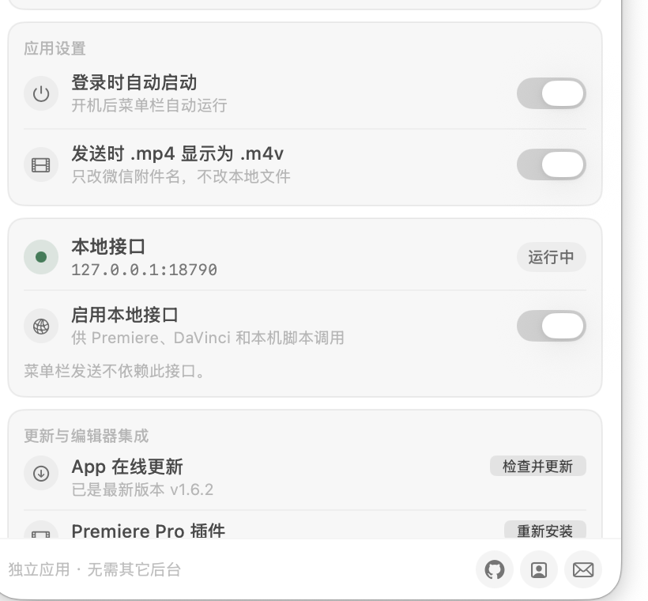

<p align="center">
  
</p>

<h1 align="center">WeClaw Send</h1>

<p align="center">把 Mac 上的文件直接发到微信，也把 Premiere 和 DaVinci 的导出接进同一条发送链路。</p>

WeClaw Send 是一个原生 macOS 菜单栏 App。扫码登录一次，以后把文件拖进面板、拖到菜单栏图标，或者从剪辑软件导出，就能直接发送到微信。

它不需要 WeClaw、OpenClaw、Node/Go 后台，也不用常驻终端。

## 用起来是什么样

打开菜单栏里的纸飞机，选择文件即可发送。最近的任务、实时进度和失败原因都会留在面板里；一次放入多个文件时，App 会自动排队。

<p align="center">
  
</p>

设置页同时管理开机启动、附件名、本地接口、在线更新，以及 Premiere、DaVinci 集成。界面会跟随 macOS 的浅色或深色外观。

## 主要能力

- 拖放或多选文件，最多并行处理 3 个任务
- 显示准备、加密、上传和发送进度
- 保存最近 20 条传输记录，失败任务可以直接重试
- 在 App 内完成微信扫码登录
- 可把微信中的 `.mp4` 附件名显示为 `.m4v`，不会修改本地文件
- 可设置登录时自动启动
- 从 GitHub Release 检查并安装 App 更新
- 在设置页一键安装或更新 Premiere 插件、安装 DaVinci 脚本

单文件上限为 200 MB。微信消息会按顺序提交，相邻消息至少间隔 2 秒。

## 安装

从 [Releases](https://github.com/double2tea/WeClawSend/releases) 下载最新的 DMG 或 ZIP，把 `WeClaw Send.app` 拖进“应用程序”后打开。

当前发布包采用 macOS ad-hoc 签名。第一次打开如果被系统拦截，请前往“系统设置 → 隐私与安全性”，找到 WeClaw Send 后选择仍要打开。之后可以在 App 设置页直接检查更新。

第一次使用只需要三步：

1. 点击菜单栏纸飞机图标。
2. 打开设置，使用微信扫码登录。
3. 回到主面板，拖入或选择文件。

更完整的图解步骤与排障方法见 [使用说明](docs/使用说明.md)。

## Premiere Pro

Premiere 插件使用 CEP 12，支持 Premiere Pro 25、26 及后续版本（manifest 当前接受 25.0–99.9）。可以在面板里：

- 自动读取当前序列名作为文件名
- 选择完整序列或 I/O 入点到出点范围
- 搜索 Adobe 导出预设
- 记住上次使用的预设、输出文件夹和自动发送开关
- 导出完成后立即释放面板，在后台继续发送
- 保留发送失败的文件，之后只重试发送，不重新渲染

推荐在 WeClaw Send 的“设置 → 更新与编辑器集成”中安装。安装后重启 Premiere，在“窗口 → 扩展 → WeClaw Send”打开面板。

自动发送依赖本地接口，使用前请在 App 设置中打开“启用本地接口”。详细说明见 [Premiere 插件文档](premiere-cep/README.md)。

## DaVinci Resolve

DaVinci 的 Deliver 后渲染脚本会在渲染成功后把结果交给 WeClaw Send，可选：

- 作为 `.m4v` 文件发送
- 作为 `.mp4` 视频发送

推荐在 App 设置页一键安装。也可以手动执行：

```sh
./scripts/install-davinci-plugin.sh
```

使用脚本前同样需要打开本地接口。脚本位置、日志和两种发送模式见 [DaVinci 插件文档](davinci-resolve/README.md)。

## 关于微信会话限制

微信 iLink 的主动发送受会话窗口和消息额度影响。如果发送返回 `ret=-2`，App 会请你在微信里给 ClawBot 发一条消息；收到新的上下文后，它会自动继续原来的发送任务。等待 5 分钟仍未收到消息，任务会明确失败，不会一直轮询。

相关背景可参考腾讯仓库中的 [会话限制反馈](https://github.com/Tencent/openclaw-weixin/issues/202) 和 [`ret=-2` 反馈](https://github.com/Tencent/openclaw-weixin/issues/225)。

## 本地接口

日常从菜单栏发送不需要本地接口。只有 Premiere、DaVinci 或本机脚本自动化时才需要开启。

接口默认关闭，只监听 `127.0.0.1:18790`，不会对局域网开放。开关状态会在下次启动时保留。

```http
GET /health
POST /send
Content-Type: application/json

{
  "file_path": "/absolute/path/to/file.m4v",
  "file_name": "中文文件名.m4v"
}
```

请求字段、返回值、错误码和调用示例见 [集成文档](docs/INTEGRATION.md)。

## 本地开发

要求 macOS 14+ 和 Swift 工具链。

```sh
chmod +x scripts/*.sh
./scripts/install.sh
```

常用验证命令：

```sh
./scripts/test.sh
./scripts/build-app.sh
./scripts/release.sh
./scripts/functional-test.sh
```

`release.sh` 会生成通用架构 App、DMG/ZIP、Premiere CEP 包、DaVinci 包、独立组件版本清单和 SHA-256 校验文件。App、Premiere 与 DaVinci 可以分别升级，不再要求三个版本号保持一致。GitHub Actions 会在推送 `v*` 标签后自动创建 Release。

## 联系

- [GitHub](https://github.com/double2tea/WeClawSend)
- [作品集](https://zeezhi.pages.dev/)
- `double_tea@foxmail.com`

微信 iLink 协议实现参考腾讯 [openclaw-weixin](https://github.com/Tencent/openclaw-weixin)（MIT），详见 [THIRD_PARTY_NOTICES.md](THIRD_PARTY_NOTICES.md)。
