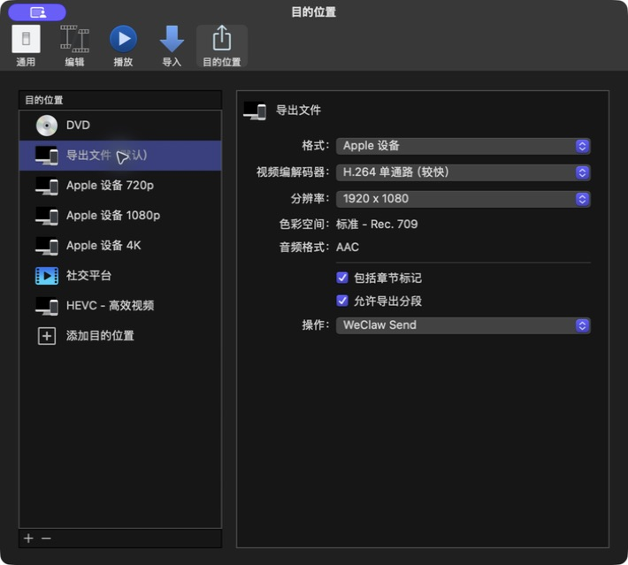

# WeClaw Send 使用说明（给朋友）

> 分享包内同时提供带图解、可直接双击查看的 `使用说明.html`。

**视频教程：** 双击分享包内的 `视频教程.webloc`，或访问 [小红书视频教程](https://xhslink.cn/o/njUmexGUhg)。

原生 macOS 菜单栏小工具：把文件直接发到微信。
**不需要** 微信网页版、命令行，也不需要其它后台程序。

**系统要求：** macOS 14 或更新，支持 Apple 芯片与 Intel 芯片 Mac

---

## 一、安装（最简单）

1. 收到 `WeClaw-Send.dmg` 或 `WeClaw-Send.zip`
2. 打开 DMG；若是 ZIP，先**解压**
3. 把 **WeClaw Send** 拖进 **「应用程序」** 文件夹
   （也可以放进用户目录下的「应用程序」）
4. 第一次打开时，系统会提示无法验证开发者；前往 **系统设置 → 隐私与安全性**，找到 WeClaw Send 后点 **仍要打开**
5. 再次确认 **打开**
6. 看屏幕**右上角菜单栏**是否出现纸飞机图标

> 不需要 Xcode，不需要终端安装脚本。拷贝 `.app` 即可。

---

## 二、第一次使用

1. 点击菜单栏 **纸飞机** 图标
2. 进入 **设置**（齿轮，或点顶部「未登录」）
3. 点 **扫码登录**
4. 用手机微信扫码，并在手机上确认
5. 若提示输入**配对码**，按手机上显示的数字填入并确认
6. 显示「已登录」后，点左上角返回发送页

登录信息只保存在你自己的电脑上，不会上传到别处。

如果 OpenClaw 已经登录微信，可在同一页把 **登录方式** 切换为 **OpenClaw**。单账号会自动选中；多账号需要手动选择。此模式不会再次扫码，但发送时要保持 OpenClaw 运行。

---

## 三、日常发送文件

任选一种方式：

| 方式 | 怎么做 |
|---|---|
| 拖到菜单栏 | 把文件拖到右上角纸飞机图标上 |
| 拖到面板 | 点开纸飞机，拖到虚线区域 |
| 选择文件 | 点开面板 →「选择文件」 |

发送时面板里的 **「发送任务」** 会先显示「等待发送」计划，再显示最近传输进度（准备 → 加密 → 上传 → 完成）。图片、视频和 PDF 显示内容缩略图，其它文件用类型图标。点缩略图或选中后按空格可预览，连按文件名在 Finder 中显示。短暂网络中断、超时或服务端临时错误会自动重试最多 3 次；CDN 上传会从头重新上传同一加密文件，并非断点续传。

右键菜单栏纸飞机可打开面板、进入设置或退出应用。发送时图标外圈会出现细进度环，待发送或排队数量显示在右上角。

### 延时发送

需要稍后再发时，点主面板任务列表旁的时钟按钮选择文件，再点一个预设时间即可加入待发送；自定义分钟后点「确定」。计划会出现在「等待发送」区，显示文件预览、预计时间和倒计时，并支持「立即发送」「改时间」和「取消」。也可以在设置里把默认发送方式改成「每次询问」或「固定延时」。拖到菜单栏纸飞机和拖入发送区仍然立即发送；`POST /send` 默认直接发送，也可在设置中改为先进入最近文件篮。右键菜单栏图标可开关文件篮、发送结果通知和本地接口。

创建计划不要求此刻已连接微信，计划会保存在本机，重启后仍可查看。到点时如果微信离线、文件已被删除/移动或内容发生变化，计划会进入「需要注意」，由你确认后再发送；应用退出期间错过时间，重新打开后也不会静默补发。延时计划只在真正开始发送时上传文件。

### 文件篮悬浮窗

文件篮适合先临时收集文件或文件夹，再决定批量发送或拖到其它 App。可以同时打开多个独立文件篮；每个篮拥有自己的项目、位置、折叠和置顶状态。它只保存路径引用，**不会复制或移动你电脑上的内容**。

文件篮也支持主动粘贴图片或纯文本：窗口获得焦点后按 `⌘V`，文件和文件夹直接加入，剪贴板图片保存为独立 PNG 项目，纯文本保存为 App 托管的 `.txt` 便笺。文本卡会显示正文摘要，双击托管便笺可进入编辑；其它项目双击或按空格为 Quick Look。托管便笺按 `⌘C` 复制正文，其它项目复制文件本身。单条文本上限为 256 KiB；App 不会在后台记录剪贴板历史。

单选一个项目后，可以点击顶部“展开阅读”、使用右键菜单或按 `⌘Return` 进入阅读模式。阅读窗口默认 640×720，并可从窗口四边、四角自由调整：TXT/Markdown 支持全部匹配高亮、前后跳转与托管文本编辑；PDF 支持连续滚动、缩放、页码、搜索和按住页面拖动平移，手形按钮可切换到文本选择；图片支持适应窗口或按解码像素显示（超大图会先缩小到 4096 像素）；视频和音频可预览、看波形、拖动进度并倍速播放；Word、Pages、PPT、Excel 和其它格式使用内嵌 Quick Look。`Esc` 返回文件篮，`⌘←` / `⌘→` 切换前后项目。

文本编辑器可一键生成待办或编号，并整理当前文本中的完成项。文本项目切换为置顶提醒栏后，`- [ ]` / `- [x]` 会显示为可点击复选项，勾选后只在所属的连续待办段内自动排序。提醒栏复用当前文件篮颜色和透明度，支持复制、编辑、立即发送、展开阅读和收回文件篮，可调整大小（最大约 760×500）；启用“退出后保存”时会恢复有效的提醒栏项目和尺寸。普通阅读模式不会在 App 重启后自动恢复。

打开方式：

| 方式 | 怎么做 |
|---|---|
| 主面板按钮 | 点文件篮按钮显示或隐藏最近使用的篮；菜单可新建、打开全部或删除 |
| 快捷键 | 默认按 `⌥⌘S`，显示或隐藏最近使用的文件篮；可在设置中重新录入 |
| 拖拽摇晃 | 拖着文件左右摇晃，在指针旁展开文件篮；松手时空篮自动收起 |

常用操作：

- 主面板管理菜单可打开指定文件篮、显示全部、关闭全部、删除指定篮或确认后删除全部文件篮
- 把文件、文件夹或 macOS 包拖进文件篮，或点击文件篮中央选择
- 文件篮默认显示三列缩略图网格，可在标题栏切换网格或列表；图片、视频与文档会尽量显示 Quick Look 缩略图，其它项目显示系统文件图标
- 文件篮顶部“…”菜单或文件项目右键菜单均可通过隔空投送、邮件和信息分享当前多选集合
- 从文件篮把项目拖出去，交给 Finder 或其它 App；从网格或列表空白处拖框，或按 `⌘A`、`⌘` 点选、`Shift` 点选可多选，再批量拖出、按 `⌘C` 复制或按 Delete 移除
- 双击托管文本便笺进入编辑；其它项目双击或点眼睛为 Quick Look 预览
- 多选后底部会显示分享、复制与移除操作；清空或移除后可在 5 秒内撤销
- 可在窗口「…」菜单修改文件篮名称、颜色与背景透明度，或彻底删除当前篮；删除篮不会删除 Finder 中的原文件，但会删除未再被引用的文本便笺和图片便笺
- 篮内仅含普通文件时点击发送会立即发送；含文件夹或包时，会先要求输入压缩包名称，再压缩成单个 ZIP 发送
- 立即发送或延时发送都支持当前文件篮；延时计划保存创建时的文件快照，创建后不会清空文件篮。含文件夹或包时，会先按名称压缩成单个 ZIP，再把 ZIP 加入计划
- 窗口「…」菜单也可主动压缩 ZIP 发送、复制全部项目或路径，并在 Finder 中显示全部项目；ZIP 发送不会清空当前篮
- 文件篮自动命名为「文件篮 1、文件篮 2……」；每个窗口可独立折叠、置顶和移动
- 关闭空文件篮会自动删除；关闭非空篮时，按「关闭时保留非空篮」设置隐藏保留或直接删除

需要注意：

- 把文件拖到菜单栏纸飞机图标上，仍然是**立即发送**，不会默认加入文件篮
- 文件篮不支持符号链接、富文本混排或后台剪贴板历史；剪贴板图片会保存为独立 PNG 项目，不嵌入文本正文
- 如果原文件被删除、改名或移动，文件篮里的引用也会失效

### 可选设置（设置页）

- **登录时自动启动**：开机后菜单栏自动出现，不用每次手动开
- **文件篮**：可开启/关闭文件篮，设置新篮默认置顶、关闭时是否保留非空篮、启动后是否恢复、发送后是否清空，以及是否允许拖拽摇晃新建
- **发送时 .mp4 显示为 .m4v**：只改微信里显示的名字，不改你电脑上的文件；DaVinci 脚本不再单独区分 MP4/M4V 模式
- **发送结果通知**：开启后，发送完成或失败会弹出系统通知；多文件会合并为一条通知，不逐条刷屏。会话刷新提醒会在恢复或结束后自动撤销；系统通知权限关闭时不会弹出阻塞提示
- **检查并更新**：优先从 GitHub Release 获取版本与 App ZIP，不可达时自动回退到官网 Cloudflare CDN；下载后仍会校验 SHA-256，再在退出后替换并重启 App
- **Premiere Pro 插件 / DaVinci Resolve 脚本**：点击对应按钮即可下载、校验并写入编辑器脚本目录；App 会识别、修复、更新或卸载本地集成，并防止线上旧版覆盖本地新版。**DaVinci 默认推荐 `WeClawSend_Lua`（无需 Python）**，完整步骤见下文「七、DaVinci Resolve 脚本」
- **反馈**：设置页「反馈」区块可打开 [产品交流与反馈](https://my.feishu.cn/docx/ZBq3dUnj1o55Q3xfJrpc9hfRnlh) 飞书文档，提交问题、建议或查看更新说明
- **帮助入口**：设置页可直接打开 [官方网站](https://weclaw-send.pages.dev/)，底部还可打开 [GitHub](https://github.com/double2tea/WeClawSend)、[个人作品集](https://zeezhi.pages.dev/from/weclaw-app) 或发送邮件

> 在线更新要求 App 所在目录可写。若提示目录不可写，请把 App 移到当前用户的「应用程序」目录后重试。

### 使用限制

- 单文件上限默认 **200 MB**，可在设置中选择 100 MB、200 MB、500 MB、1 GB 或 2 GB；较大文件仍可能被微信服务拒绝
- 最多同时处理 **3 个文件**；加密和 CDN 上传可并行，微信消息提交保持串行且间隔约 **2 秒**
- 微信会话有时效和发送额度限制；触发限制时 App 会提示你给 **ClawBot 发一条消息**，收到后自动重试原文件
- 请保持应用在运行（菜单栏有图标）；退出后无法发送
- 延时计划在应用运行时到点触发；退出期间错过的计划会在下次启动时等待确认，不会自动补发

---

## 四、打不开 / 菜单栏没有图标（解决方法）

按顺序试，多数情况前两步就能解决。

### 1. 系统提示“无法验证开发者”（首次打开）

1. 先尝试打开一次 WeClaw Send，让系统记录拦截
2. 打开 **系统设置 → 隐私与安全性**
3. 往下找到 WeClaw Send 被阻止的提示
4. 点 **仍要打开**，输入登录密码或使用触控 ID
5. 在确认框中再点 **打开**

这是未加入 Apple Developer Program 的版本，首次打开必须由电脑所有者手动批准。

### 2. 系统提示“已损坏，无法打开”

删除当前 App，重新打开原始 DMG 或解压原始 ZIP，再拖入「应用程序」并按上一步批准。不要使用来源不明的终端命令绕过系统检查。

### 3. 双击后好像没反应

- 看**菜单栏右侧**（Wi‑Fi、电池附近）有没有纸飞机
  本应用**不会**固定出现在程序坞（Dock）
- 若菜单栏图标太多，点 `>>` 展开再找
- 到「应用程序」里再开一次 WeClaw Send
- 若仍没有：退出后重开
  菜单栏图标 → 设置 → 退出，再双击 App

### 4. 能打开，但发不了 / 提示未登录

1. 设置里确认是否 **微信已登录**
2. 未登录则重新 **扫码登录**
3. 网络需能访问微信服务；公司网/代理异常时可能失败
4. 文件是否超过设置中的「单文件大小上限」；过大请提高档位，或先压缩、切片
5. 若 App 提示会话需要刷新，给 ClawBot 发任意消息；App 获取新会话后会自动重试，不必再次选择文件

### 扫码确认后一直等待

这通常表示二维码已经扫到，但微信还没有返回最终登录确认。先在微信里给 **ClawBot 发一条任意消息**；不少情况下登录会随即完成。

如果仍未完成，取消本次登录并重新扫码，同时暂时关闭 VPN、代理或网络过滤工具。若选择了 OpenClaw 登录方式，确认 OpenClaw 正在运行且所选账号仍然有效。App 最多等待 5 分钟，超时后会结束转圈并显示处理建议。

### 5. 发送排队或耗时较久

- 同时处理数已满 3 个时，其余文件会排队
- 大文件加密、上传本身需要时间，可在「最近传输」查看“加密 / 上传 / 等待提交 / 提交”状态
- 短暂网络中断、超时或上游 `500/502/503/504` 会自动重试最多 3 次；仍失败时会显示发生在“获取上传地址 / CDN 上传 / 提交微信消息”的具体阶段
- 失败项可点击「重新发送」再次入队
- 若一直失败：看失败原因文字；可尝试重新登录微信

### 6. 换电脑 / 重装后

- 需要在新电脑上**重新扫码登录**（登录态不会跟着 App 拷贝走）
- 把旧的 `.app` 删掉，换成新发的版本即可

### 7. Intel 芯片 Mac

- 当前分享包同时包含 `arm64` 与 `x86_64`，支持运行 macOS 14 或更新系统的 Intel Mac

---

## 五、Premiere Pro 25+ 面板（可选）

项目只提供 CEP 12 版本，不需要 UXP Developer Tool：

1. 推荐：在 WeClaw Send **设置 → 更新与编辑器集成 → Premiere Pro 插件 → 一键安装**
2. 重新打开 Premiere Pro
3. 前往 **窗口 → 扩展 → WeClaw Send**
4. 从面板下拉框选择用户或系统导出预设
5. 选择「完整序列」或「入点到出点（I/O）」；I/O 未设置或范围无效时面板会提示
6. 若要导出后自动发送，先在 WeClaw Send 设置中开启「本地接口」

也可以手动解压 `WeClaw-Send-Premiere-CEP12.zip` 并双击 `安装.command`。

面板会自动扫描预设并记住上次选择，不需要手动查找 `.epr` 文件。面板重新获得焦点时会同步当前序列名，手动修改过的文件名不会被覆盖；同名输出已存在时会阻止覆盖，完成后可在 Finder 中显示。修改导出参数时，在 Premiere 原生导出页保存预设，再回到面板点击「刷新」。

自动发送默认关闭；关闭时只执行导出。开启后面板会在导出前检查本机接口，渲染完成即允许继续操作并在后台发送；一个或多个发送失败时可逐个仅重试发送，不会重复渲染。

## 六、Final Cut Pro 自动发送（可选）

Final Cut Pro 使用系统原生的分享完成动作，不需要安装插件，也不需要开启 WeClaw Send 的「本地接口」。此功能需要 **WeClaw Send 1.6.8 或更高版本**。



1. 把最新版 WeClaw Send 放进 `/Applications`，打开并确认微信已登录
2. 打开 **Final Cut Pro → 设置 → 目的位置（Destinations）**
3. 选择 **导出文件（Export File）**
4. 在右侧把 **操作（Action）** 设为 **其他（Other）**，选择 `/Applications/WeClaw Send.app`
5. 返回后确认「操作」显示 **WeClaw Send**
6. 使用这个目的位置分享项目；Final Cut Pro 提示分享成功后，WeClaw Send 会弹出并开始发送

建议选择 H.264 或 HEVC，把单个成片控制在 **200 MB** 以内。如果不想让所有默认导出都自动发送，可以先复制一个「导出文件」目的位置并命名为「导出并发送微信」；如果希望 `Command-E` 直接发送，则把它设为默认。

如果 Final Cut Pro 显示分享成功，但 WeClaw Send 没有新增传输记录，请确认 App 版本不低于 1.6.8，并在「操作 → 其他」中重新选择 `/Applications/WeClaw Send.app`，避免仍指向旧版本或另一份 App。

## 七、DaVinci Resolve 脚本（可选）

Deliver 后渲染提供两个入口（安装时默认 dual，推荐优先用 Lua）：

| 入口 | 说明 |
|---|---|
| **WeClawSend_Lua**（推荐） | 用 macOS `curl` 调本地接口，**不需要 Python** |
| **WeClawSend_Python**（可选） | Resolve 内直接跑 Python，仅在你明确要用 `.py` 时选择 |

1. 在 WeClaw Send **设置 → 更新与编辑器集成 → DaVinci Resolve 脚本** 点击安装 / 修复 / 更新；不需要时可点「卸载」。Premiere 插件同样支持卸载。新版安装会自动清理旧的 `自动发送ClawBot_*` 等脚本。
2. 安装成功后，设置页会显示安装路径；可点「显示路径」确认 `WeClawSend_Lua.lua`（及可选的 `WeClawSend_Python.py`）
3. 在 WeClaw Send 设置中开启「本地接口」
4. **完全退出并重新打开** DaVinci Resolve（`Cmd + Q`），脚本只在启动时扫描
5. 打开项目，进入 Deliver 页，在「在渲染作业结束时触发脚本」中优先选择 `WeClawSend_Lua`；`WeClawSend_Python` 为可选入口

也可在菜单 `工作区 → 脚本 → Deliver` 中确认脚本是否已加载。MP4/M4V 显示名由设置「发送时 .mp4 显示为 .m4v」处理，脚本不再分模式。

脚本会安装到用户 Deliver 目录；若系统目录可写也会同步安装，不修改项目文件或导出预设：

```text
~/Library/Application Support/Blackmagic Design/DaVinci Resolve/Fusion/Scripts/Deliver/
/Library/Application Support/Blackmagic Design/DaVinci Resolve/Fusion/Scripts/Deliver/
```

若脚本下拉只有「无」：

1. 先点「显示路径」，确认已有 `WeClawSend_Lua.lua`（不是旧的 `自动发送ClawBot_*`）
2. 确认已彻底重启 DaVinci Resolve
3. 确认安装脚本与打开 Resolve 使用的是同一个 macOS 用户


---

## 八、安全与隐私（简要）

- 登录态保存在本机：
  `~/Library/Application Support/WeClawSend/`
  仅当前用户可读
- 文件经加密后上传微信通道，与微信客户端同类能力
- 可选的本机接口 `127.0.0.1:18790` 默认关闭，只给脚本和剪辑软件自动发送使用，**普通使用可以忽略**

---

## 九、怎么退出 / 卸载

**退出：** 菜单栏纸飞机 → 设置 → **退出**

**卸载：**

1. 先退出应用
2. 把「应用程序」里的 WeClaw Send 移到废纸篓
3. （可选）删除登录数据：
   `~/Library/Application Support/WeClawSend`
4. （可选）若装过 Premiere / DaVinci 集成：在卸载 App 前，可先在设置页点对应「卸载」；或手动删除当前用户下的插件 / 脚本目录

---

## 十、发给朋友的三句话版

1. 把 WeClaw Send 拖进「应用程序」，尝试打开一次。
2. 系统设置 → 隐私与安全性 → 找到拦截提示 → 仍要打开。
3. 菜单栏点纸飞机 → 设置 → 扫码登录，再把文件拖到纸飞机图标发送。
